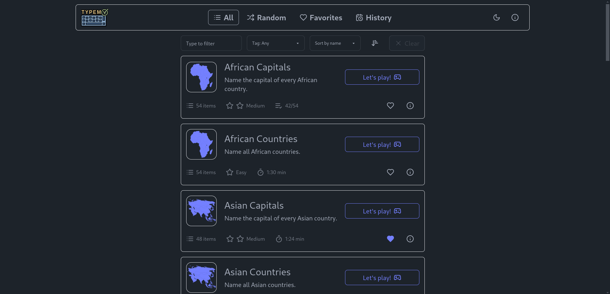

<p align="center">
  <a href="https://typem.fjelloverflow.dev">
    
  </a>
</p>

<h1 align="center">
  <a href="https://typem.fjelloverflow.dev">Typem</a>
</h1>

<p align="center">
   Type out the list items as quickly as possible.
</p>

<p align="center">
  
</p>

<p align="center">
  
  &ensp;
  
  &ensp;
  
</p>

<p align="center">
  <a href="https://typem.fjelloverflow.dev">Play now!</a> |
  <a href="#the-game">The Game</a> |
  <a href="#installation">Installation</a> |
  <a href="#development">Development</a>
</p>

## The Game

Typem ("Type them") is a time-based game where the player types out a list of items as quick as he can.

### Features

- 📚 Grow knowledge
- 🧠 Strengthen memorization skills
- ⌨️ Improve typing speed
- 🏆 Track past performance

### How it works

While typing, the game automatically checks the answers, keeping track of the progress. The objective is to complete the list in the shortest time possible, testing both typing speed, knowledge, and memorization skills! Many built-in lists (including hints) are available, mostly geography-themed.

Try it now at [typem.fjelloverflow.dev](https://typem.fjelloverflow.dev)!

## Installation

The projects runs in [bun](https://bun.sh/), a NodeJS compatible JavaScript environment.

```sh
git clone https://github.com/FjellOverflow/typem.git
cd typem
bun install
```

To install the recommended extensions for VSCode, open the _Extensions_ tab and type `@recommended`.

## Development

To start the dev-server run `bun run dev`. All commands are called with `bun run <command>`, the most common ones are:

- `dev`: start dev server
- `build`: build project
- `test:unit`: run unit tests
- `test:e2e:dev`: interactive e2e tests

For a full list of all commands, check the `scripts` section in `package.json`.

> [!WARNING]  
> While the scripts can also be run with just `bun <script>`, the `build` commands needs to be run with `bun run build`, as `bun build` will instead use bun's built-in builder, instead of Vite.
